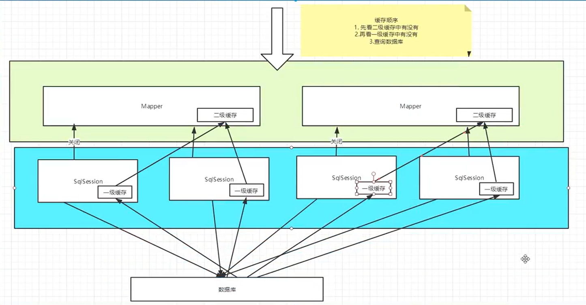

Mybatis

官方网站教程:

https://mybatis.org/mybatis-3/zh

## mybatis执行流程

## 动态sql

什么是动态sql?

动态sql是指根据不同的条件生成不同的sql语句

if

choose (when, otherwise)

trim (where, set)

foreach

1. 什么是缓存?
   - 存在内存中的临时数据
   - 将用户经常查询的数据放在缓存(内存)中,用户去查询数据就不用从磁盘上(关系型数据库文件)查询,从缓存中查询,从而提高查询效率,解决了高并发系统的性能问题.
2. 为什么使用缓存
   - 减少和数据库的交互次数,减少系统开销,提高系统效率
3. 什么样的数据能使用缓存
   - 经常查询并且不经常改变的数据.

## Mybatis缓存
   - mybatis包含一个非常强大的查询缓存特性,它可以非常方便的定制和配置缓存,缓存可以极大的提升查询效率.
   - mybatis系统中默认定义了俩级缓存:一级缓存和二级缓存
     - 默认情况下,只有一级缓存开启.(sqlSession级别的缓存,也称为本地缓存)
     - 二级缓存需要手动配置,他是基于namespace级别的缓存
     - 为了提高拓展性,mybatis定义了缓存接口Cache.我们可以通过实现cache接口来定义二级缓存
   - 一级缓存
     - 与数据库同一次会话期间查询到的数据会放在本地缓存中.
     - 以后如果需要获取相同的数据,直接从缓存中拿,没必要再去查询数据库.
   - 二级缓存
     - 二级缓存也叫全局缓存,一级缓存的作用域太低了,所以诞生了二级缓存
     - 基于namespace级别的缓存,一个名称空间,对应一个二级缓存
     - 工作机制
       - 一个会话查询一条数据,这个数据就会被放在当前会话的一级缓存中
       - 如果当前会话关闭了,这个会话对应的一级缓存就没了,一级缓存中的数据会保存到二级缓存中.
       - 新的会话查询信息,就可以从二级缓存中获取内容
   - 小结
     - 只要开启了二级缓存,在同一个mapper下有效
     - 所有数据都会先放到一级缓存中
     - 只有当会话提交,或者关闭的时候,才会提交到二级缓存中
   
## 缓存原理
   